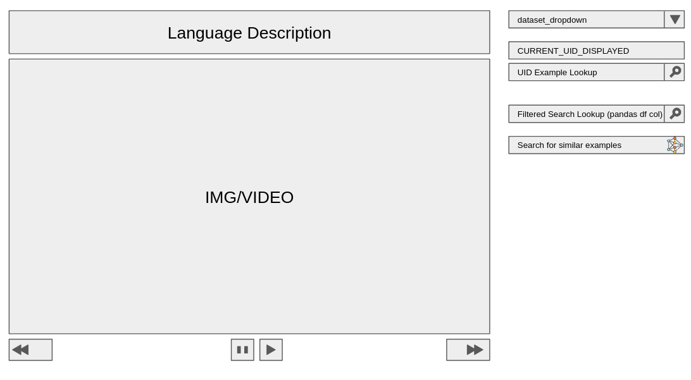
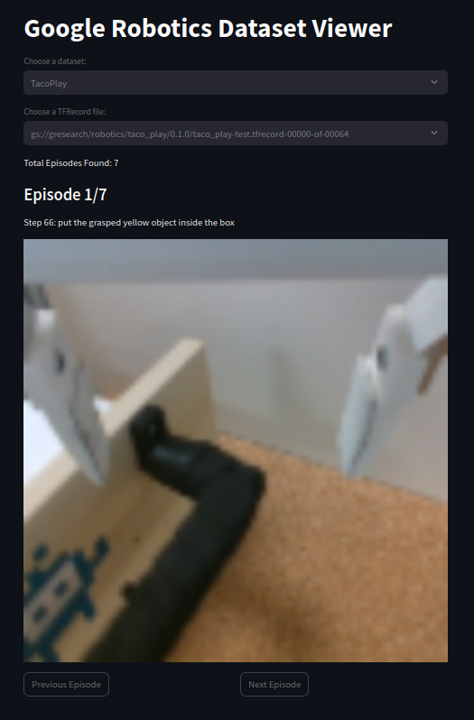

# rtx-data-viewer-streamlit-app

This viewer allows researchers to get a general sense of the quality and tasks for each dataset in the RT-X dataset.

Goal Viewer:


Current Viewer:



## Setup
1. ```$ git clone git@github.com:EAI-Datasets-Exploration/rtx-data-viewer-streamlit-app.git```
2. ```$ conda env create -f environment.yml```
3. ```$ conda activate rtx-streamlit-app```

## How to Run
1. ```$ streamlit run app.py```

### Troubleshooting
If you encounter the following issue: 

`tensorflow.python.framework.errors_impl.AbortedError: {{function_node __wrapped__IteratorGetNext_output_types_1_device_/job:localhost/replica:0/task:0/device:CPU:0}} All 10 retry attempts failed. The last failure: Error executing an HTTP request: libcurl code 60 meaning 'SSL peer certificate or SSH remote key was not OK', error details: SSL certificate problem: unable to get local issuer certificate`

You can directly run:

```$ conda install -c conda-forge certifi```

Then, re-run the program.